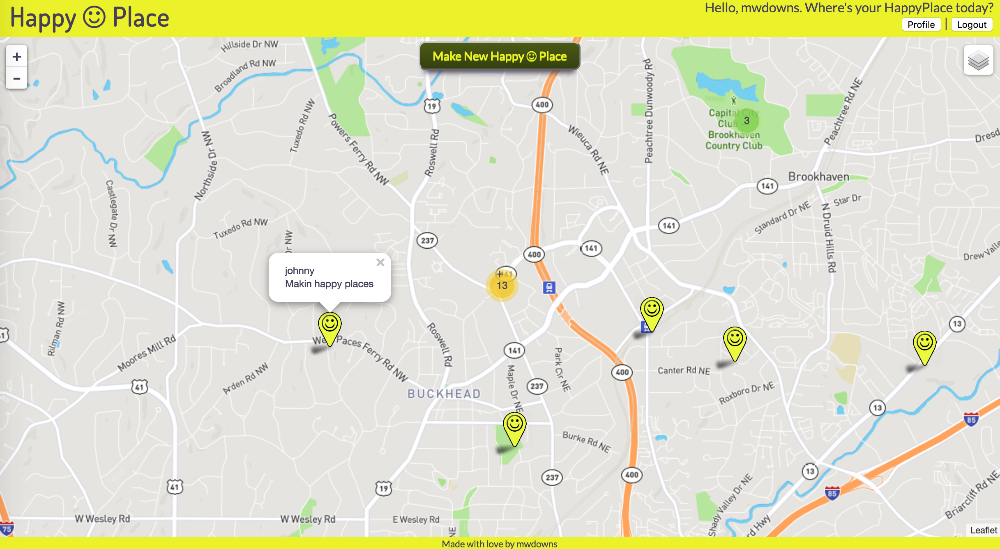

HappyPlace
==========

No likes. No favorites. Just your happy places.

HappyPlace is a web-app for keeping track of place and time that made you happy.

HappyPlace was build using the MEAN stack: HTML/CSS and AngularJS on the frontend with NodeJS and MongoDB on the backend. For rendering the map I used the Leaflet and the [Angular Leaflet Directive](http://tombatossals.github.io/angular-leaflet-directive/#!/). The map-tiles were from MapBox and OpenStreetMaps.

Setup
-----
If you'd like to see a live version of HappyPlace, visit [happyplace.click](http://happyplace.click).

For a local version, feel free to clone the repository, run
```
npm install
```
in the directory where you cloned it, and make sure that you have MongoDB installed on your computer as well. Then run
```
node backend.js
```
in the terminal and type
```
localhost:8000
```
into your browser bar. When you create a user (click the signup button on the page), the app will initialize the happyplace_db in Mongo.

HowTo
-----
The app is relatively intuitive. When not signed in, you can view the world happyplaces, but you can not create a happyplace. Once you create an account, you can create happylaces.

To create a happyplace, simply click on the map and move the crosshair in the middle of the page to the place you want to create and click the "create a happy place" button. Your happyplace marker should appear on the map, and you should be able to edit or delete the message in the marker popup.



Challenges
---

#### 1. Rendering the Map

Initially I was using the <leaflet> map element on whichever individual templateURLs needed a map (e.g. the the landing.html template, which shows all of the happyplaces in the world, for when users hadn't logged in and the myhappyplaces.html template, which shows just the user's happyplaces, for when a user had logged in). This seemed to cause a problem with placing markers when you moved from one state to the next. The world markers would load when you first came to the site, but when a user would log in, she would have to do a manual refresh of the page in order to clear the world markers and place her markers on the map. I wanted the markers to load and reload automatically when a user moved from state to state. The solution ended up being to make one <leaflet> map element and load it on the index.html page and to make the marker list a $rootScope variable that each controller has access to no matter what state the user is on. Then when the user moves from state to state, to reinitialize the marker list and then update it on the move.

#### 2. Geolocation

Getting a user's location is slow. And rendering the map is relatively quick. If I waited for the geolocation coordinates before rendering the map I'd end up with a grey box instead of a map. The solution to this ended up being to first, set a hard coded center for the map (the ATV, home of HappyPlace), two, create a separate function to get the geolocation coordinates, and finally three, to update the hardcoded center when the geolocation function gets the user's coordinates.

```javascript
if (navigator.geolocation) {
  navigator.geolocation.getCurrentPosition(findPosition);
}
else {
  console.log('does not use geolocation');
}

function findPosition(data) {
  $scope.center.lat = data.coords.latitude;
  $scope.center.lng = data.coords.longitude;
  $scope.center.zoom = 14;
}
```

It's still a bit wonky in that sometimes the geolocation fires quickly, sometimes it takes a couple seconds to fire. I should set a timeout somewhere so that if it doesn't fire after 2 seconds to not do it at all.

#### 3. Editing and deleting markers on the finally

This was a pesky bug that took me a while to figure out (create an ugly workaround?). The messages that one makes for a happyplace includes a bit of html along with the message which adds an edit and remove button to the marker message. If a user clicks on the edit button another input form (like for happyplace creation) is shown so that the user can edit her happyplace. If the user clickes on the remove button, the happyplace is removed from the map and the database. The button functions "worked", but would cause some weird behaviors. If editing, when the user would complete the edit, the marker message would change but would show the embedded html as well. Very ugly. But, if the user closed the marker message and then reopened it, the message would appear normal. If the user removed a marker, the map would jump to the next marker in the markers array and display that marker's message with the embedded html as well. The solution ended up being to add the .closePopup() method to the clickedMarker variable (a variable that is created when a user clickes on a marker).

```javascript
$rootScope.changeMessage = function(editMessage) {
  if ($rootScope.editMessage) {
    for (var i = 0; i < $rootScope.markers.length; i++) {
      if ($rootScope.markers[i].id === $rootScope.clickedMarkerID) {
        $rootScope.markers[i].message = $rootScope.editMessage + markerHTML;
        $rootScope.clickedMarker.closePopup();
      }
    }
    $rootScope.editMarker = false;
    happyplaceService.editMessage($rootScope.clickedMarkerID, $rootScope.editMessage)
    .then(function(data) {
      console.log('you updated the message', data);
    })
    .catch(function(err) {
      console.log('you got a error, ', err);
    });
  }
};
```

Future Functionality
---

Of course HappyPlace is far from done. This is a project I came up with a few months ago and think is a worthwhile project to continue developing even after I've finished with my study here at DigitalCrafts.

#### 1. Editing a user's profile

This is probably the first thing I need to do, and maybe the easiest (famous last words?). A user should be able to edit their username, email, and password. Also, maybe there should be an avatar for the user, which leads to the next section...

#### 2. Allow a single picture to display on a happyplace marker popup.

This I think will be more of a challenge. The question is where to store the pic and how to get at it. I've had some classmates talk about using Google Cloud storage, or some other cloud storage, to keep the pictures. I'll have to check into that.

#### 3. Make HappyPlace an actual app for Android and iOS devices

This is the ultimate goal in that HappyPlace is an "app". The responsive design is just a workaround so that a user can use HappyPlace on their phone. But using it in a phone's web-browser is clunky at best. For this I think I'm going to have to use Ionic.

#### 4. Redo the frontend in Angular2 or maybe another framework.

This is more of a personal goal rather than a necessary improvement. I like HappyPlace, so it would be interesting to teach myself some new frameworks by creating something I like.
